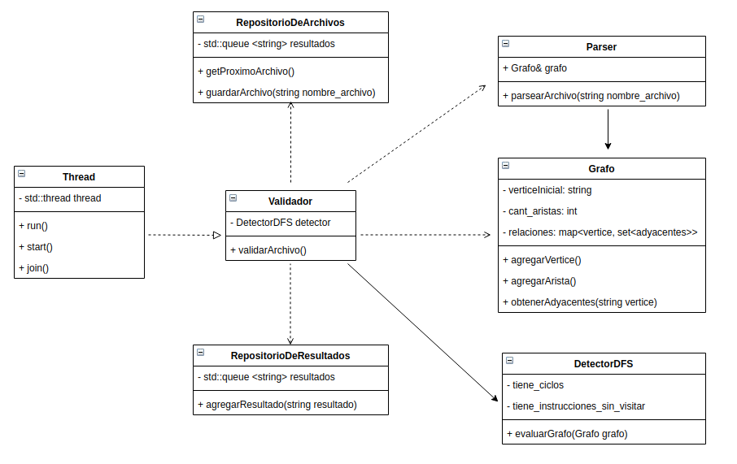
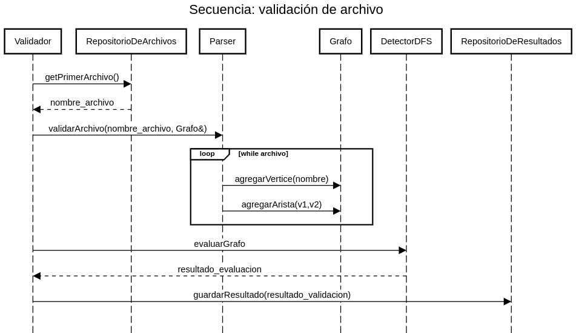

## **INFORME TP 2**

**Alumno:** Andrés Fernández

**Padrón:** 102220

**Link al repositorio:** https://github.com/andres912/Taller_TP2

### **DESCRIPCIÓN**

El siguiente diagrama de clases muestra a alto nivel los principales métodos y atributos de las clases:

El siguiente diagrama de secuencia muestra el proceso de validación de un archivo BPF:

El trabajo lo hice básicamente en dos partes:

* La primera parte está dedicada a todos los objetos relacionados a parsear un archivo, convertirlo en un grafo y poder detectar ciclos e instrucciones no usadas en ese archivo. Los objetos creados con ese propósito son los siguientes:

	- Grafo: es básicamente un map(vertice, set_de_adyacentes) al cual se le pueden agregar vertices y aristas. Los vértices son strings: si una línea tiene etiqueta el vértice es el nombre de la etiqueta, de lo contrario, el vértice es el número de la línea (empezando de 1). De esta forma, dos vértices no pueden tener el mismo nombre (se asume que las etiquetas no son sólo números). EL Grafo guarda su vértice inicial, para que pueda validarse correctamente.

	- Parser: es el objeto que se encarga de armar el grafo a partir de un archivo. Abre el archivo, lee de a una línea por vez, y de acuerdo a ciertos criterios, agrega vértices y aristas al grafo.

	- DetectorDFS: es quien se encarga de validar un archivo, a partir del grafo del mismo. Si encuentra un ciclo en el grafo, inmediatamente corta la detección y lo informa. Si llegó al final y no visitó a todos los vértices del grafo, informa que hay instrucciones sin usar. Si ninguna de las dos es cierta, informa que el archivo es correcto.

* La segunda parte está relacionada al uso de threads de acuerdo a lo solicitado por el enunciado:

	- RepositorioDeArchivos: guarda los nombres de los archivos recibidos en argv en una cola. La sección de código en la cual se desencola un archivo está protegida con un lock_guard.

	- RepositorioDeResultados: guarda los resultados de las validaciones de los archivos en una cola. La sección de código en la cual se encola un resultado está protegida con otro lock_guard.

	- Thread: es un objeto que encapsula el comportamiento de un std::thread. Tiene los métodos básicos de creación, destrucción, run, start y join.

	- Validador: es un objeto que hereda de Thread y que implementa los métodos de Thread que son abstractos. Es quien se encarga de:

		* Pedir un archivo al RepositorioDeArchivos.

		* Validar el archivo utilizando un DetectorDFS instanciado como atributo, y creado en cada validación un Grafo y un Parser.

		* Guardar el resultado de la validación en el RepositorioDeResultados.

### **COMENTARIOS**

Las principales dificultades que presentó el trabajo fueron:

* La introducción de un nuevo lenguaje que de por sí es bastante complejo como C++, y el hecho de pasar de un lenguaje de programación estructurada a uno orientado a objetos (aunque en el TP 1 básicamente se buscó simular una orientación a objetos).

* La complejidad propia de C++ en cuanto a referencias, punteros, move semantics, etc. Principalmente fue complicado tener que dejar de usar punteros para darle prioridad a las referencias, teniendo en cuenta las restricciones propias de las referencias (no pueden ser NULL, no pueden declararse sin definirse...).

* Entender las cuestiones básicas del funcionamiento de los threads. Es un tema completamente nuevo y, aunque se nota que lo pedido en este TP es relativamente básico, entender bien cómo funcionan los threads, los mutex y los locks tiene su complejidad.

* Respetar lós conceptos de la orientación a objetos, en cuanto a la lógica de la abstracción de los objetos, no sobrecargar a un sólo objeto con muchas responsabilidades, tratar de tener alta cohesión y baja dependencia.

* Lo resultante de mezclar todo lo anterior. Por ejemeplo, en un momento quise pasar por referencia a los repositorios al objeto Validador, para que los tuviera como atributos. Pero cuando quería guardarlos, no podía utilizar el operador =. Los repositorios tenían como atributo un mutex, lo que destruía el operador = por defecto. Quise sobrecargar el operador = de los repositorios, pero no sabía cómo hacer para pasar el mutex al nuevo objeto dentro de la sobrecarga. Finalmente, decidí dos cosas: que los repositorios no tuvieran un mutex como atributo, ya que lo usaban en un sólo método, y que el Validador tampoco tuviera a los repositorios como atributos, sino que se pasaran dentro de un sólo método. Podría haber hecho una sola de estas dos cosas, pero me pareció que tenía más sentido hacer ambos cambios.

